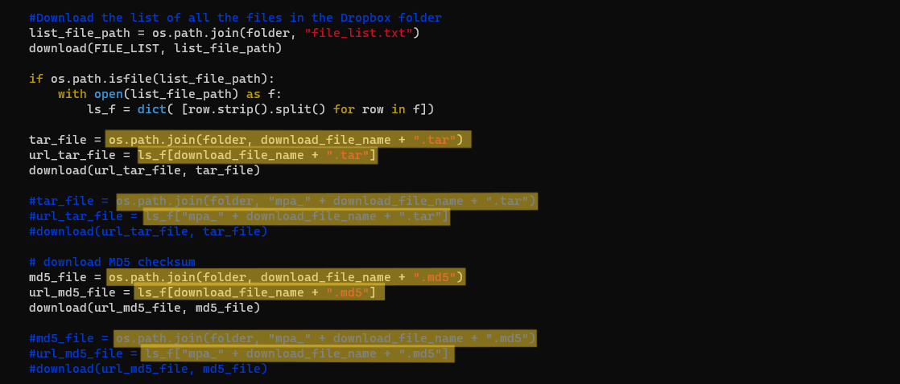
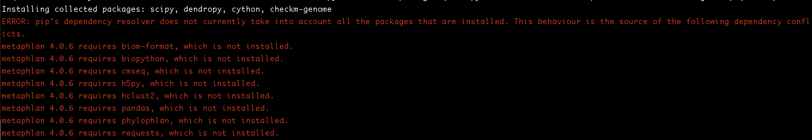

# Software installation

***
## Aspera, 23.4.5
```bash
> su
> lanlab
> conda install -c hcc aspera-cli -y
> which ascp
/miniconda3/bin/ascp
> ls /miniconda3/etc/asperaweb_id_dsa.openssh
/miniconda3/etc/asperaweb_id_dsa.openssh # key location
```

***
## MMSeqs2, 23.4.6
```bash
> conda create -n MMseqs2
> source activate MMseqs2
> (MMseqs2) conda install -c conda-forge -c bioconda mmseqs2
> (MMseqs2) mmseqs -h

# After downloading the uniref100 database
> cd ~/genome/uniref/mmseqs_uniref100_database
> mmseqs createdb uniref100.fasta.gz mmseqs_uniref100_db
> mmseqs createtaxdb seqTaxDB tmp
```

***
## MetaPhlAn3, 23.4.6
```bash
> conda create -n MetaPhlAn
> source activate MetaPhlAn
> (MetaPhlAn) conda install -c bioconda metaphlan
> (MetaPhlAn) which metaphlan
~/.conda/envs/MetaPhlAn/bin/metaphlan
# download metaphlan_index.zip and file_list.txt and upload them to ~/.conda/envs/MetaPhlAn/lib/python3.6/site-packages/metaphlan/metaphlan_databases, and unzip metaphlan_index.zip
# In ~/.conda/envs/MetaPhlAn/lib/python3.6/site-packages/metaphlan/metaphlan.py, modify the code of line ~460-470 as shown:
```
 
```bash
> metaphlan metagenome.fastq --input_type fastq -o metaphlan_test_out.txt # the reference is automatically constructed for the first running.
```

***
## MetaPhlAn4, 23.4.12
```bash
> cd /home/zhanggaopu/software/metaphlan

# metaphlan4 can't be installed with conda, so manually install.
> git clone https://github.com/biobakery/MetaPhlAn.git
> cd MetaPhlAn
> pip install .
> mkdir /home/zhanggaopu/software/metaphlan/bowtie2db
> metaphlan --install --bowtie2db /home/zhanggaopu/software/metaphlan/bowtie2db

# create an environment with dependencies of metaphlan4
> conda create -n mpa numpy Biopython python=3.7
> source activate mpa
> (mpa) conda install -c bioconda bowtie2

> (mpa) metaphlan metagenome.fastq --input_type fastq -o out.txt --bowtie2db /home/zhanggaopu/software/metaphlan/bowtie2db
# RAW of the container for running metaphlan should be >100G.

> (mpd) conda deactivate
```

***
## HUMAnN 3.0, 23.4.13
```bash
> mkdir ~/software/humann
> cd ~/software/humann

> wget https://files.pythonhosted.org/packages/79/02/184aef0cea1ad47be1dc5a9227096dbce5db190f6ed1f164e352f85ca257/humann-3.6.1.tar.gz
> tar -xzvf humann-3.6.1.tar.gz

> cd humann-3.6.1
> su # go to root to install since creating folders requires permission
lanlab
> python setup.py install
# exit root

# download the ChocoPhlAn databse
> mkdir ~/software/humann/humann_database
> cd ~/software/humann/humann_database
> humann_databases --download chocophlan full ~/software/humann/humann_database

# when performing humann_test, error is reported due to the too new version of metaphlan database. So use metaphlan to download a previous version (vJan21) of database, and specifically use it for humann.
> mkdir ~/software/metaphlan/bowtie2db_for_humann
> metaphlan --install --index mpa_vJan21_CHOCOPhlAnSGB_202103 --bowtie2db ~/software/metaphlan/bowtie2db_for_humann

# when use humann, use the --metaphlan-options to denote the position and the version of the database. 
> cd ~/software/humann/humann_test
> humann --input ../humann-3.6.1/examples/demo.fastq --output ../humann_test/demo_test.out/ --metaphlan-options "--bowtie2db /home/zhanggaopu/software/metaphlan/bowtie2db_for_humann --index mpa_vJan21_CHOCOPhlAnSGB_202103"
```

***
## Crass 1.0.1, 23.4.20
```bash
> conda create -n crass
> source activate crass
> (crass) conda install -c conda-forge -c bioconda crass
> (crass) crass --version
CRisprASSembler (crass)
version 1 subversion 0 revison 1 (1.0.1)

> (crass) conda install -c bioconda cap3
> (crass) conda install -c bioconda velvet

# Some other packages were installed with conda. But seemed to be useless for crisprtools.
> (crass) conda install -c conda-forge xerces-c
> (crass) conda install -c anaconda libtool
> (crass) conda install -c anaconda make
> (crass) conda install -c conda-forge autoconf
> (crass) conda install -c anaconda automake
> (crass) conda install -c conda-forge gcc

> (crass) crisprtools
crass (1.0.1)
crass is a set of smal utilities for manipulating .crispr files
The .crispr file specification is a standard xml based format for describing CRISPRs
Type crass <subcommand> -h for help on each utility
Usage:	crass <subcommand> [options]

subcommand:  merge       combine multiple files
             help        display this message and exit
             extract     extract sequences in fasta
             filter      make new files based on parameters
             sanitise    change the IDs of elements
             stat        show statistics on some or all CRISPRs
             rm          remove a group from a .crispr file

# Graphviz is installed to visualize the .gv files of CRISPR assembly graph.
> (crass) conda install -c anaconda graphviz
```

***
## MinCED 0.4.2, 23.4.20
```bash
> conda create -n minced
> source activate minced
> (minced) conda install -c bioconda minced
> (minced) minced --help
> (minced) conda install -c bioconda seqkit
```

***
## MetaCrast, 23.4.20
```bash
# difficult to install, not done.
```
## seqspec for constructing library, 23.4.21
```bash
> pip install seqspec
> seqspec format --help
```

***
## ncbi-genome-download, 23.4.25
```bash
> conda create -n ngd
> source activate ngd
> (ngd) conda install -c bioconda ncbi-genome-download
> (ngd) ncbi-genome-download --help
```

***
## Kraken/Kraken2, 23.4.28
```bash
> conda create -n kraken
> source activate kraken
> (kraken) conda install -c bioconda kraken2
> (kraken) kraken2 --version
> (kraken) conda install -c conda-forge rsync

> (kraken) cd ~/genome/human/kraken_db
> (kraken) kraken2-build --download-library human --db human_db

> (kraken) kraken2-build --download-taxonomy --db human_db
# failed. Not fixed yet. kraken2 can't work now.
```

***
## fastp, 23.4.28
```bash
> conda create -n fastp
> source activate fastp
> (kraken) conda install -c bioconda fastp
> (kraken) fastp --help
```

***
## SPAdes, 23.4.29
```bash
> conda create -n spades
> source activate spades
> (spades) conda install -c bioconda spades
> (spades) spades.py --help
```

***
## MEGAHIT, 23.4.29
```bash
> conda create -n megahit
> source activate megahit
> (megahit) conda install -c bioconda megahit
> (megahit) megahit --help
```

***
## Graphviz, 23.5.2
```bash
> su 
lanlab
> (root) yum install graphviz
> which dot
```

***
## nextpolish, 23.5.23
```bash
> conda create -n nextpolish
> source activate nextpolish
> (nextpolish) conda install -c bioconda -c conda-forge nextpolish 
```

***
## Canu & quast, 23.5.23
```bash
> conda create -n canu
> source activate canu
> (canu) conda install -c bioconda canu
> (canu) conda install -c bioconda quast
```

***
## minimap2 & seqkit, 23.5.28
```bash
> conda create -n minimap
> sourcer activate minimap
> (minimap) conda install -c bioconda minimap2
> (minimap) conda install -c bioconda seqkit
```

***
## Crisprcasfinder, 23.5.31
```bash
> conda create -n crisprcasfinder
> source activate crisprcasfinder
> (crisprcasfinder) conda install -c bioconda macsyfinder=2.0
```

***
## cd-hit, 23.6.8
```bash
> conda create -n cdhit
> source activate cdhit
> (cdhit) conda install -c bioconda cd-hit
```

***
## checkM, 23.7.17
```bash
> conda create -n checkm python=3.9
> conda install -c bioconda numpy
> conda install -c bioconda matplotlib
> conda install -c bioconda -c conda-forge pysam
> conda install -c bioconda hmmer
> conda install -c bioconda pplacer
> conda install -c bioconda prodigal

> conda install -c bioconda biopython
> conda install -c bioconda -c conda-forge biom-format
> conda install -c bioconda -c conda-forge cmseq
> conda install -c bioconda -c conda-forge h5py
> conda install -c bioconda -c conda-forge hclust2
> conda install -c bioconda pandas
> conda install -c phylophlan
> conda install -c bioconda requests

> pip3 install checkm-genome

> cd ~/software/checkm/
> wget https://data.ace.uq.edu.au/public/CheckM_databases/checkm_data_2015_01_16.tar.gz -c
> tar -xzvf checkm_data_2015_01_16.tar.gz
# decompress the gz file
> checkm data setRoot checkm_data_2015_01_16/
```


***
## VirSorter2, 23.9.15
```bash
# Install with the option 1 from https://github.com/jiarong/VirSorter2
mamba create -n vs2 -c conda-forge -c bioconda virsorter=2
source activate vs2

# Download and setup the database.
virsorter setup -d db -j 4

# No numpy package is downloaded with the conda/memba install, so the numpy package in the /.local python site-packages will be called, which will lead to AttributeError.
# Install numpy<1.24 in the vs2 env.
conda install "numpy<1.24"

# Disable the user site-packages directory /.local by setting to False.
python -m site -help 
#/home/zhanggaopu/.conda/envs/vs2/lib/python3.10/site.py [--user-base] [--user-site]
# ENABLE_USER_SITE = None > ENABLE_USER_SITE = False
```
Ref: https://github.com/python/cpython/blob/f59c0932b4e160f279fb98de4cdad2f58269e0a5/Lib/site.py#L79-L81

***
## CRISPRcasTyper (cctyper)
```bash
conda create -n cctyper -c conda-forge -c bioconda -c russel88 cctyper
```

***
## GTDB-tk
```bash
conda create -n gtdbtk
source activate gtdbtk
conda install -c bioconda gtdbtk
download-db.sh # automatically download database of gtdbtk and archive it to /home/zhanggaopu/.conda/envs/gtdbtk/share/gtdbtk-2.1.0/db/gtdbtk_r207_v2_data.tar.gz.
```
